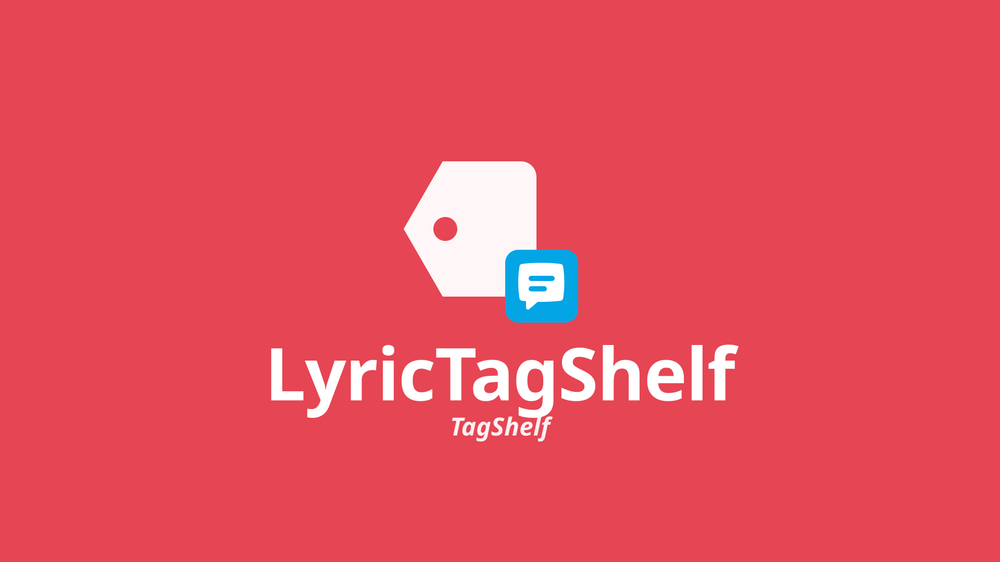

<p align="center">
  
</p>

# LyricFin: Get Timed Lyrics

<p align="center">
  
</p>

A Jellyfin plugin that fetches **timed LRC** lyrics from [LRCLIB](https://lrclib.net/) - synced only, no plain-text fallback.

**Jellyfin 10.11+** · scheduled task + one settings button.

## Why

Jellyfin’s stock LrcLib provider often leaves you without usable timed lyrics. LyricFin talks to LRCLIB directly, keeps only `syncedLyrics`, and writes them as `.lrc` through Jellyfin’s lyric manager.

## How it works

1. **Scheduled task** (`LyricFin: Get Timed Lyrics`) - fills tracks that are **missing** lyrics.
2. **Settings → Fetch all lyrics** - queues `LyricFin: Fetch All Lyrics` (force overwrite). Runs as a scheduled task so the browser request cannot time out.
3. Lookup order: LRCLIB `/api/get` (with duration) → get without album → `/api/search` for the best synced match.
4. ExplicitFin-style marks (`🅴`, `[Explicit]`, …) are stripped from titles before searching (configurable, same ignore list as MusicFin).
5. **Skip (Instrumental) titles** (on by default): scheduled runs ignore `(Instrumental)` / `[Instrumental]`; force fetch **clears** lyrics on those tracks.

## Providers

LRCLIB is the best free, no-key option for synced LRC and is what LyricFin uses. Alternatives exist (Musixmatch, NetEase, Megalobiz via scrapers, Spotify/Musixmatch proxies) but usually need API keys, ToS risk, or brittle scraping — not wired in yet.

## Installing
**Step 1**
<p align="center">
  
</p>

**Dashboard --> Plugins --> Manage Repositories** --> **+ New Repository**:
   - Name: `FinPlugins` (or whatever :P )
   - URL: `https://raw.githubusercontent.com/TidBits16/FinPlugins/main/manifest.json`
   <br>
   (p.s. this bundle includes my other FinPlugins since they are designed to work together. ***they are not required to install!***)
<br>
<center><strong>**Then Restart JellyFin!**</strong></center>

**Step 2**
<p align="center">
  
</p>

**Plugins** --> **All** --> **LyricFin: Get Timed Lyrics** --> **Install**

<center><strong>**Once Installed, Restart JellyFin Again!**</strong></center>

## Build Locally

For development or packaging your own build:

```bash
dotnet build Jellyfin.Plugin.LyricFin.csproj -c Release
./scripts/package.sh
```

The release zip will be in `dist/`.

Designed for **Jellyfin 10.11+** (you probably have this already :D )
<p align="center">
  
</p>
